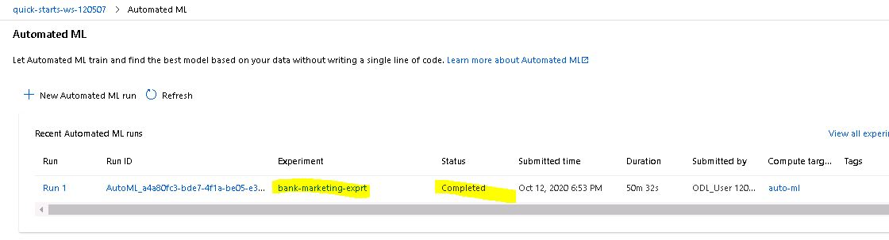
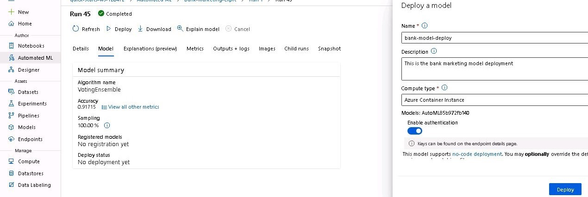
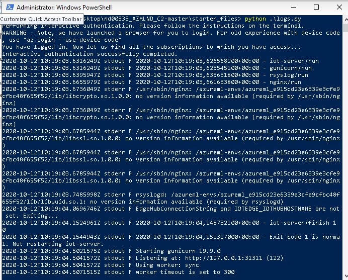
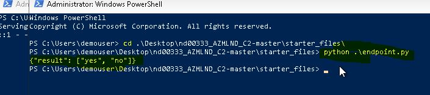

# Operationalizing Machine Learning

In this project, you will continue to work with the Bank Marketing dataset. You will use Azure to configure a cloud-based machine learning production model, deploy it, and consume it. You will also create, publish, and consume a pipeline. In the end, you will demonstrate all of your work by creating a README file and a screencast video.

## Architectural Diagram

## Key Steps

1. Authentication: I used the lab provided by udacity to complete this section, thus no screenshots are provided here for authentication as it is already implemented in the virtual lab.

2. Automated ML Experiment: Here I used created a new Automated ML run, used the [Bank-Markerting dataset](https://automlsamplenotebookdata.blob.core.windows.net/automl-sample-notebook-data/bankmarketing_train.csv).

    - Created a new experiment with name *bank-marketing-exprt* 
    - Created new cluster *auto-ml* with Standard_DS12_v2 for the Virtual Machine Size and selected 1 as the number of minimum nodes.
    - Run the experiment using *Classification*, set *Exit criterion* to 1 hour and reduced *Concurrency* to 1.

3. Deploy the best model: After a successfull run of the bank-marketing-exprt, we obtained the bet model algorithm *VotingEnsemble* 
    - We then deploy the model in an Azure Container Instance.
    - I named the deployment *bank-model-deploy* and enable authentication to securely deploy the model.
4. Enable logging: The model was sucessfully deployed and then I ran the *logs.py*
    - I also enabled Application Insights in this file with the code `service.update(enable_app_insights=True)`. 
    - The `logs.py` file ran correctly producing logs as in the screenshot.
      
 
5. Swagger Documentation: After a successful model deployment I could obtan the endpoint rest API including the *swagger.json* file generated.
    - I downloaded the `swagger.json` file into the swagger directory.
    - Then from the Git Bash terminal I ran the cmmand `bash swagger.sh` from the swagger directory to start the wagger documnetation API service.
    - I then ran the `serve.py` file to serve the swagger.json file holdint the HTTP API methods and response for the model.
    - Once the server is running I open he browser and run `http://localhost:9000`, then in the Swagger instance running, I explore our *swagger.json* file at, `http://localhost:8001/swagger.json`
    

6. Consume model endpoints; With the swagger instance running correclty, we can now conum the endpoint
    - I obtaned the scoring URI and key generated after the deplyment and updated the `endpoint.py` file.
    - From new a powershell terminal, I navigated to the project files and ran the `python endpoint.py`  and got the results in the screenshot below. 
    
    - After running the endoint.py file, I obtained a json paylod in the file `data.json`
    - I updated the `benchmark.sh` with the generated scoring URI and key.
    - Next I also ran the *banchmark.sh* file from a new Git bash terminal with the command `bash benchmark.sh`, and got the following.
    

7. Create and publish a pipeline: I crted an published a pipline  runninng the notebook file provided in the project files.
    - First I uploaded the Jupyter notebook, `aml-pipelines-with-automated-machine-learning-step.ipynb`, to Azure ML Studio.
    - I created an expriment 

8. Documentation: This README.md document contains:
    - Project Overview
    - Architetural Diagram
    - Screenshots of project main steps with shorta descriptions
    - Suggettion for improvemnt
    - Link to screencast

## Screen Recording
I made a short screencast available in the link [here](https://youtu.be/yTN2xGAwhRw) showing the; 
    - Deployed Model
    - Deployed Pipeline
    - Automated ML Model
    - API request to the endpoint with json payload.

## Standout Suggestions
To improve for future us, we can get more data sameple point for the dataset to enhance the model.
